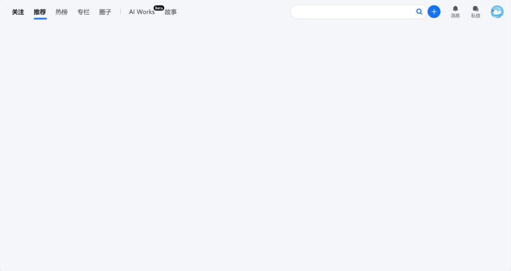
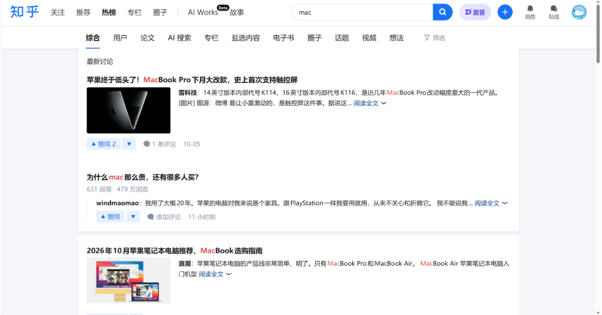

# 知乎极简净化 - 纯净专注与全回答展开终极版

  
  
  
  

  <b>切断无休止的算法信息流，自动展开折叠回答，还你一个纯净、高效、沉浸的知乎知识检索与阅读体验。</b>

---

## 目录

- [设计背景与核心理念](#-设计背景与核心理念)
- [效果实测截图与场景对比](#-效果实测截图与场景对比)
  - [1. 首页效果 —— 纯白极简，仅留顶栏核心功能](#1-首页效果--纯白极简仅留顶栏核心功能)
  - [2. 搜索页与沉浸阅读效果 —— 搜索放行，去广告去浮标](#2-搜索页与沉浸阅读效果--搜索放行去广告去浮标)
- [核心功能全景一览](#-核心功能全景一览)
- [小白安装使用教程](#-小白安装使用教程)
  - [步骤一：安装脚本管理器扩展](#步骤一安装脚本管理器扩展)
  - [步骤二：安装本脚本（一键 / 手动）](#步骤二安装本脚本一键--手动)
- [技术亮点与核心架构](#-技术亮点与核心架构)
- [常见问题解答 (FAQ)](#-常见问题解答-faq)
- [版本更新记录](#-版本更新记录)
- [开源协议与免责声明](#-开源协议与免责声明)

---

## 🎯 设计背景与核心理念

知乎作为高价值知识与经验问答社区，其网页版常驻着大量的诱导性内容：
- **首页瀑布流陷阱**：首页无限滚动的推荐信息流和热搜榜，极易让人在查阅资料时不知不觉“刷”过去几个小时；
- **反复折叠打断思路**：问答页面回答默认只显示几行，需要频繁手动点击“阅读全文”或“展开更多”；
- **各类广告与浮动干扰**：右下角悬浮客服、右侧栏电商推销与各种赞助商 Banner 严重挤压阅读空间。

本脚本融合了**首页绝对极简留白**与**沉浸深度阅读**两大核心诉求：
* **首页彻底空白化**：隐藏信息流与右侧模块，仅保留顶栏核心导航与搜索，拒绝算法诱惑；
* **问答自动展开**：进入问答页后自动展开所有回答全文，一目了然；
* **沉浸阅读居中**：专栏与问答页侧栏精简，主体内容自动居中对齐，排版更优雅；
* **全站精准去广告**：全站拔除广告卡片、赞助商推荐与悬浮客服浮标。

---

## 📸 效果实测截图与场景对比

### 1. 首页效果 —— 纯白极简，仅留顶栏核心功能

* **顶栏精炼美化**：隐藏首页大蓝色“知乎”图标，保持“关注、推荐、热榜、专栏、圈子、AI Works 故事”等导航标签整齐排列；右侧完整保留搜索框、蓝色“+”提问按钮、消息通知、私信与个人头像。
* **搜索框交互净化**：清空输入框内不断滚动的诱导性热搜词（Placeholder 保持纯白空白），下拉推荐隐藏热搜排行榜，保留搜索历史。
* **首页主体彻底空白**：彻底隐藏首页无限下拉的信息流瀑布流（`Topstory-container`）、轮播大卡片与右侧创作中心，整版呈现纯白无干扰看板！

---

### 2. 搜索页与沉浸阅读效果 —— 搜索放行，去广告去浮标

* **搜索结果 100% 完整放行**：
  * 输入关键词搜索后，综合、用户、论文、AI 搜索、专栏、盐选内容、电子书等分类 tabs 及排序筛选完全正常可用。
* **彻底拔除搜索页右侧栏**：
  * 彻底隐藏右侧冗余的“大家都在搜”推荐卡片、帮助中心、举报中心及页脚备案信息；
  * 搜索主体内容居中自适应，排版纯粹干净，杜绝右侧闲杂热搜干扰。
* **问答与专栏沉浸体验**：
  * 进入问题页后，脚本自动模拟点击“展开更多”与“阅读全文”，**自动一键展开所有优质回答**，无需逐个手动点击；
  * 专栏文章与问答页隐藏多余侧边栏，正文主体自动扩宽居中自适应，告别左右拥挤。
* **去广告与悬浮杂质**：
  * 全站自动拦截 Commercial 商业推广卡片、广告横幅（`.Card.Banner`, `.Pc-card`, `.Pc-word`）；
  * 彻底抹除右下角常驻悬浮的客服小猫按钮（`div:has(> .css-1yuhvjn)`），还您干爽的阅读视野。

---

## 📋 核心功能全景一览

| 功能场景 | 原始知乎网页版体验 | 净化后体验 |
| :--- | :--- | :--- |
| **首页推荐信息流** | 双列/单列无限滚动瀑布流，充斥娱乐热点与算法推荐 | **彻底清空隐藏**，呈现纯白极简留白看板 |
| **首页顶栏** | 蓝色大 Logo 占用空间，推荐词不断滚动闪烁 | 隐藏大 Logo，**保留分类标签、搜索框、提问与头像**，清空轮播词 |
| **搜索框下拉菜单** | 强推全网热搜与各类营销词条 | 隐藏下拉热搜推荐，**完整保留个人搜索历史** |
| **搜索结果页面** | 正常展示搜索结果 | **100% 完美放行**，全部分类与筛选正常运作 |
| **问答页面回答** | 默认折叠内容，必须频繁手动点击“阅读全文” | **智能自动展开所有回答全文**，沉浸连续阅读 |
| **专栏文章页面** | 右侧常驻作者推销、相关推荐等繁杂侧栏 | 隐藏侧栏，正文居中扩宽自适应，排版更具呼吸感 |
| **全站广告与浮标** | 充斥商业赞助卡片、Banner 以及右下角悬浮客服小猫 | 全站拔除各类广告卡片与客服浮标，界面洁净如初 |

---

## 🚀 小白安装使用教程

### 步骤一：安装脚本管理器扩展

在使用本脚本前，请确保您的浏览器（Edge、Chrome、Firefox、Safari、Brave 等）已安装以下任意一款脚本管理器扩展：

* **篡改猴 (Tampermonkey)**：[官方网站安装](https://www.tampermonkey.net/) *(强烈推荐)*
* **脚本猫 (ScriptCat)**：[官方网站安装](https://scriptcat.org/)
* **暴力猴 (Violentmonkey)**：[官方网站安装](https://violentmonkey.github.io/)

---

### 步骤二：安装本脚本（一键 / 手动）

#### 方式 1：一键在线安装（推荐）

直接点击下方链接，浏览器脚本管理器将自动弹出确认安装窗口，点击**“安装”**或**“更新”**即可：

* 🚀 [直接点击安装最新版本 (GitHub 官方源)](https://raw.githubusercontent.com/zhengjiewen666/zhihu-minimal-clean/master/zhihu-minimal-clean.user.js)
* ⚡ [国内高速镜像一键安装 (加速源)](https://ghproxy.net/https://raw.githubusercontent.com/zhengjiewen666/zhihu-minimal-clean/master/zhihu-minimal-clean.user.js)

#### 方式 2：手动复制导入

1. 点击打开本项目脚本源码文件：[`zhihu-minimal-clean.user.js`](./zhihu-minimal-clean.user.js)；
2. 全选并复制文件中的全部代码；
3. 打开浏览器的 Tampermonkey / 脚本猫 控制面板，点击“新建脚本”；
4. 清空原有内容，将复制的代码粘贴进去，按 `Ctrl + S` 保存；
5. 打开或刷新 [知乎官网](https://www.zhihu.com/) 即可生效。

---

## 🔬 技术亮点与核心架构

1. **原生零依赖重构 (Vanilla JS)**：
   * 彻底剥离了陈旧已失效的第三方 jQuery 外链引用，全面采用现代原生 ES6+ 标准 API 实现，加载速度更快、执行更轻量、零外部网络依赖与安全隐患。
2. **CSS 先行预加载与零白屏闪烁**：
   * 声明 `@run-at document-start`，在 DOM 树初步解析的最早阶段注入核心样式，结合根节点 `data-zhihu-clean="home"` 属性标记，从底层根除“内容闪现”问题。
3. **精准场景自适应状态机**：
   * 智能识别首页、问答页、专栏文章页与搜索结果页；
   * 首页专用的信息流隐藏规则严格限定在首页，问答页的居中与展开规则严格限定在问答页，**互不干扰，互不越界**。
4. **异步渲染防脱靶机制**：
   * 针对知乎富文本问答的异步懒加载特性，设计了多层防御展开调度（初始加载、MutationObserver 动态补获、阶梯延时重试），确保进入问答页后所有回答稳定展开。

---

## ❓ 常见问题解答 (FAQ)

#### Q1：首页为什么只有顶栏，下方是一片纯白？
> **A**：这正是本脚本的核心初衷！彻底切断知乎算法推荐流对注意力的侵蚀，让首页仅作为您主动搜索知识的跳板。当您输入关键词搜索时，所有干货内容将 100% 正常呈现。

#### Q2：问答页面的“阅读全文”会自动点开吗？
> **A**：是的！脚本内置了回答全文自动展开逻辑，打开问题后会自动点击展开按钮，方便您一口气阅读完整篇回答，无需频繁用鼠标逐一点开。

#### Q3：输入框里的搜索历史会被清除吗？
> **A**：不会！脚本仅清除了知乎平台推送的默认占位热词与热搜榜，您自己搜索过的内容会完整保存在历史记录中。

---

## 📜 版本更新记录

### v6.0 (终极融合版)
- 🎉 **双版本深度融合**：全面兼并首页纯白极简与沉浸阅读全回答自动展开两大核心能力；
- 🚀 **性能原生化升级**：移除陈旧 jQuery 依赖，改写为原生现代 JavaScript，速度与兼容性大幅提升；
- 🛡️ **广告与浮标精细清理**：优化右下角客服小猫浮标与商业赞助卡片的过滤算法；
- 📖 **全中文文档重构**：编写超详细图文效果对照与小白安装指南。

---

## 📄 开源协议与免责声明

- 本项目采用 [MIT 许可证](./LICENSE) 开放源代码，允许自由学习、修改与分享。
- 本脚本仅通过前端 CSS 与 DOM 操作进行界面纯净美化与阅读辅助，不采集任何用户隐私数据，亦不篡改网络通讯。
- “知乎”及相关商标版权归北京智者天下科技有限公司所有。
